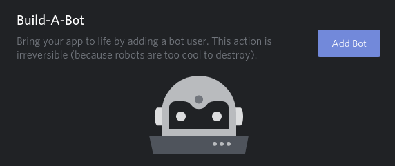

# thebard-discordbot

Discord bot for RPG Game Masters


## Commands

List of available commands: wushu
- `/r initiative` to roll 1D20 for initiative

- `/r <atk> <def>` to roll <atk>D6 for attack and <def>D6 for defense

- `/r quick` to roll a quick success test

- `!stream` to invite the bot in your current vocal channel, and start streaming from `config.iceCastUrl` in your config/base.json
 
 
## Installation

You will need to install icecast + darkice (Linux) or butt (Windows) to stream audio from your computer to the bot. 

Rename `config/base.demo.json` to `config/base.json`


### Icecast stream server

First, you need a way to diffuse audio with icecast

```shell script
sudo apt-get install icecast2
```

Edit icecast config `/etc/icecast2/icecast.xml` and set user/password

```xml
<authentication>
        <!-- Sources log in with username 'source' -->
        <source-password>your-password</source-password>
        <!-- Relays log in username 'relay' -->
        <relay-password>your-password</relay-password>
 
        <!-- Admin logs in with the username given below -->
        <admin-user>admin</admin-user>
        <admin-password>password</admin-password>
</authentication>
```

Restart icecast2 with new config

```sudo /etc/init.d/icecast2 stop && sudo /etc/init.d/icecast2 start```


### DarkIce to stream desktop audio to the Stream Server

```shell script
sudo apt-get install darkice
```
You can edit the darkice config file in `config/darkice.cfg` to suit you icecast config

Launch DarkIce to redirect your local audio to the stream server

```shell script
darkice -c /path/to/darkice.cfg
``` 

If you go to [icecast admin page](http://localhost:8000/) you should see thebard.ogg mountpoint ready to play

Fill the `config/base.json` iceCastUrl section to match your server setup


## Setup the discord Bot

Go to [Discord developers portal](https://discordapp.com/developers/applications) and create a new application.

Copy the CLIENT ID to your `config/base.json` file 

Click on it, and go to the bot tab to create the bot



Check the **bot token** and click to reveal


Copy the secret token to your `config/base.json` file 

